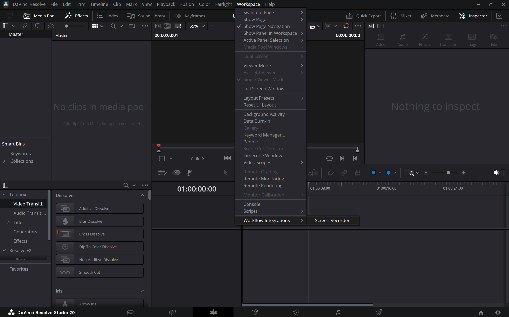

# Recorder Plugin for DaVinci Resolve 
## (Screen record, camera record, partial screen record, window record)
## WARNING
/!\ Vibe Coded Project

Tested on windows on ARM on DaVinci Resolve Studio 20.2.2 build 10 it may not work elsewhere, though it's mostly javascript and ffmpeg so should mostly work everywhere and be able to adapt for your config

# Installation
To install it you need to put the `ScreenRecorder` folder to :
    Mac OS X:
        `"/Library/Application Support/Blackmagic Design/DaVinci Resolve/Workflow Integration Plugins/"`

    Windows:
        `"%PROGRAMDATA%\Blackmagic Design\DaVinci Resolve\Support\Workflow Integration Plugins\"`

# Launch it
And relaunch DaVinci and launch it by going to `Workflow` -> `Workflow Integration` -> `Screen Recorder`

# Shortcuts
You can launch and stop record also via shortcuts even if DaVinci is not in the foreground which is quite neat.
